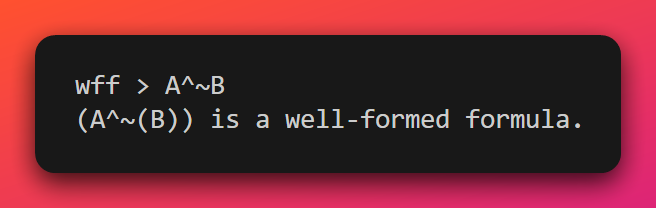
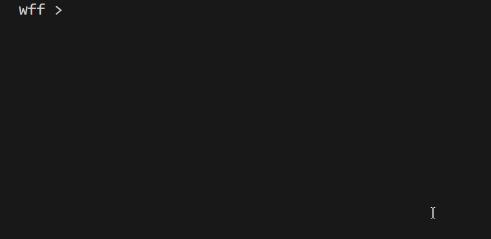
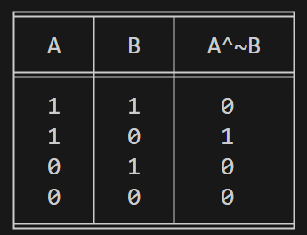
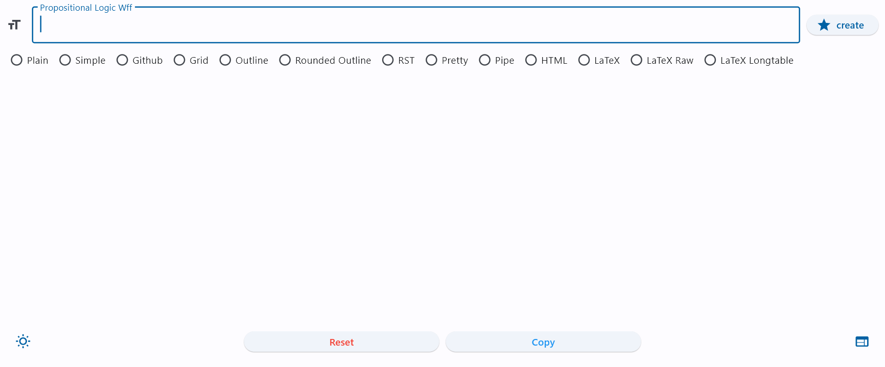
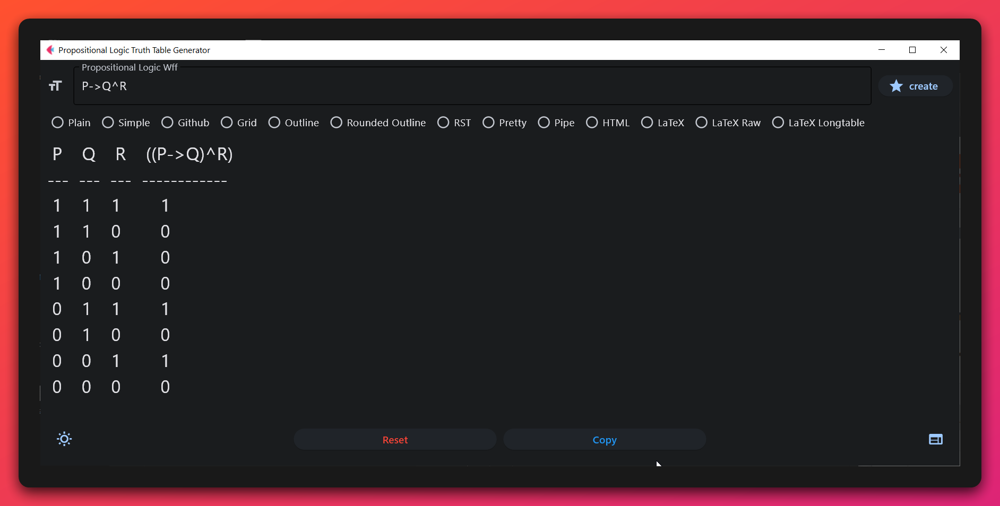

# Logic Syntax Checker & Truth-Table Generator

Checks the syntax of propositional logic formulas and generates a truth table from the formula. There is also a GUI (using [flet](https://flet.dev/)). 

If you are looking for a truthtable generator for Python, then I would recommend this one: [truth-table-generator](https://pypi.org/project/truth-table-generator/). It is more robust and I'm not a programmer. I made this because I teach introduction to logic courses and thought it would be fun. I submitted it as a final project for [Harvard's CS50p](https://cs50.harvard.edu/python/2022/). 


## Installation

- Copy the repo.
- Install all the requirements `pip install - r /path/to/requirements.txt`
- Run either `ft_gui.py` to run the GUI or `logic_generator.py` for command line.

    
## Usage/Examples

The `logic_generator.py` has two main classes: the `WffValidator` class and the `TruthTable` class. The former checks syntax, the latter generates a truth table. 



With respect to the `WffValidator` class, a string is passed to an instantiation of the `WffValidator` class. When the `.print_valid_wff()` method is used on this instantiation, the terminal will print out whether the wff is syntactically correct.

```python
s = input("wff > ")
wff = WffValidator(s)
wff.print_valid_wff()
```



You can instantiate the `TruthTable` class with a string representing a logical expression and call the `.print_table()` method to output a table in the terminal.

```python
w = input("wff > ")
table = TruthTable(w)
table.print_table()
```



The program uses `tabulate` and the default output is `fancy_outline`, but you can use any of the other styles from `tabulate` by passing in one of the styles from tabulate to the print_table method, specifically `tablefmt=`. Here are some examples:

`table = TruthTable(s)`
`table.print_table("pipe")`

|  A  |  B  |  A^~B  |
|:---:|:---:|:------:|
|  1  |  1  |   0    |
|  1  |  0  |   1    |
|  0  |  1  |   0    |
|  0  |  0  |   0    |

---

`table = TruthTable(s)`
`table.print_table("html")`

```html
<table>
<thead>
<tr><th style="text-align: center;"> A </th><th style="text-align: center;"> B </th><th style="text-align: center;"> A^~B </th></tr>        
</thead>
<tbody>
<tr><td style="text-align: center;"> 1 </td><td style="text-align: center;"> 1 </td><td style="text-align: center;">  0   </td></tr>        
<tr><td style="text-align: center;"> 1 </td><td style="text-align: center;"> 0 </td><td style="text-align: center;">  1   </td></tr>        
<tr><td style="text-align: center;"> 0 </td><td style="text-align: center;"> 1 </td><td style="text-align: center;">  0   </td></tr>        
<tr><td style="text-align: center;"> 0 </td><td style="text-align: center;"> 0 </td><td style="text-align: center;">  0   </td></tr>        
</tbody>
</table>
```

---

`table = TruthTable(s)`
`table.print_table("latex")`

```latex
\begin{tabular}{ccc}
\hline
  A  &  B  &  A\^{}\textasciitilde{}B  \\
\hline
  1  &  1  &   0    \\
  1  &  0  &   1    \\
  0  &  1  &   0    \\
  0  &  0  &   0    \\
\hline
\end{tabular}
```

## GUI

I made a GUI using flet. You can run the `ft_gui.py` file and it will open a GUI.





## Authors

- [@davidagler](https://www.github.com/davidagler)


## Roadmap

There are a few things I'd like to do in the future.

1. Generate truth tables for multi-valued logic
1. Check multiple wffs -> list input instead of string
1. `verbose`: calculate truth-value output for every subformula.
1. `satisfiable`: simple check set of wffs for satisfiability.
1. Improve GUI


## Acknowledgements

 - [Introduction to yacc](https://www.youtube.com/watch?v=yTXCPGAD3SQ&list=PLXMBJ899tuoo3Zx28hLFGbn_aWG8jV3Ey)
 - [Harvard's CS50p](https://cs50.harvard.edu/python/2022/)


## Some other tidbits


In terms of the syntax checker, the program takes a string as input. The string is then checked using [PLY](https://www.dabeaz.com/ply/), which is a Python implementation of the lex lexer and the yacc parser. The lexer involves specifying a set of token names:

```python
tokens = (
   'CONJUNCT',
   ...
)
```

and then using regular expressions to select these tokens:

```python
t_CONJUNCT = r'\^|\&|and'
```

The parser uses yacc, which works by adding a symbol to the stack, looking ahead in the string, and trying to reduce it to a syntactically correct form. Here is a video explanation [Introduction to yacc](https://www.youtube.com/watch?v=yTXCPGAD3SQ&list=PLXMBJ899tuoo3Zx28hLFGbn_aWG8jV3Ey). The reduction rules are specified using a series of functions and yacc notation.

```python
def p_wff_disjunction(p):
    'subwff : subwff DISJUNCT subwff'
    p[0] = f"({p[1]}v{p[3]})"

def p_factor_letter(p):
    'subwff : LETTER'
    p[0] = p[1]
```

The program also uses yacc and several other functions to calculate the truth values of formulas. Here is an example:

```python
def p_wff_conjunction(p):
    'subwff : subwff CONJUNCT subwff'    
    p[0] = min(p[1], p[3])

def p_factor_tvalue(p):
    'subwff : TVALUE'
    p[0] = int(p[1])
```

Once we know that the user input is syntactically correct, the program creates a truth table using several functions. Rather than printing it as a list or dict, the program uses the `tabulate` module. Here is the function responsible for printing the table (it is part of the `TruthTable` class).

```python
def print_table(self, tablefmt="fancy_outline", numalign="center"):
    print(tabulate(self.int_val(), headers=self.s_formula, tablefmt=tablefmt, numalign=numalign))
```
